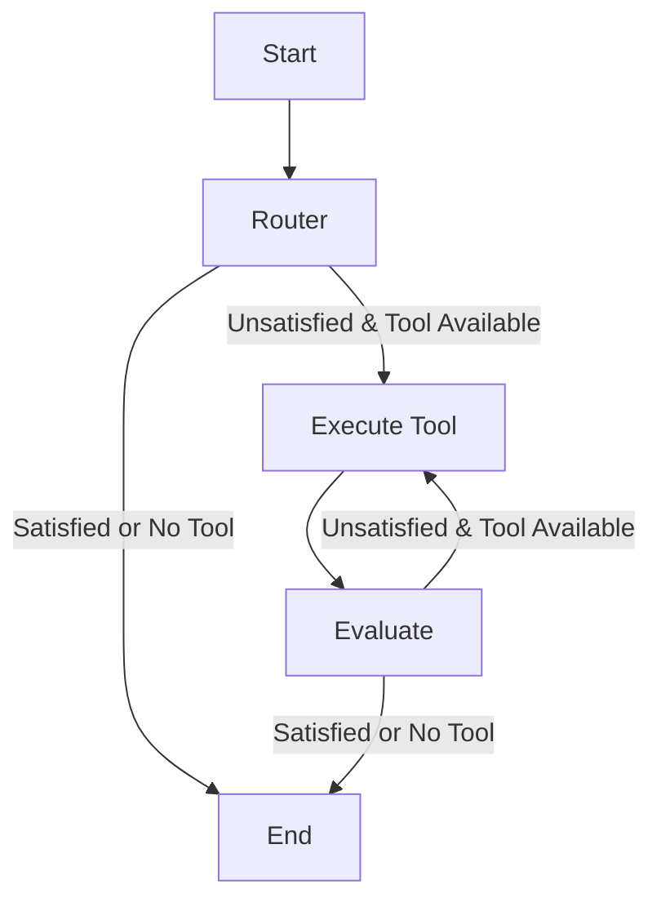

# PROJECT PILER

## pilerbot
personal bot for managing a discord server based on piler (my ed tech community)

## About Piler

Welcome to **Piler**, a vibrant and dynamic Discord community designed for enthusiasts across various fields including mathematics, statistics, computer science, data science, machine learning, finance, economics, and startups. Our mission is to bring together individuals who share a passion for these disciplines, fostering a collaborative environment where learning and growth are at the forefront.

## Our Community

**Piler** serves as a hub for professionals, students, and hobbyists who are eager to connect, collaborate, and elevate their knowledge. Whether you are delving into the intricacies of machine learning, exploring the depths of data science, or navigating the complexities of finance and economics, you'll find a community that shares your interests and ambitions.

### What We Offer

1. **Learning Opportunities:** We offer a range of educational resources, including live workshops, tutorials, and in-depth discussions on topics such as mathematics, statistics, data science, and machine learning. As a member, you'll have access to exclusive content and learning materials created and curated by experts in the field.

2. **Collaborative Projects:** Engage in collaborative projects that span across various domains. Whether you're interested in working on data analysis, developing machine learning models, or exploring financial trends, you can connect with like-minded individuals and work on exciting initiatives together.

3. **Blogs and Articles:** Stay updated with our blogs and articles that cover a wide array of topics. Our content includes tutorials, case studies, and insights into the latest trends and advancements in mathematics, statistics, data science, and machine learning. Be the first to access valuable knowledge and practical tips from industry experts.

4. **Networking and Mentorship:** Build your professional network by connecting with experts and peers in your field. Our community provides a platform for mentorship, where experienced members can offer guidance and support to newcomers and those seeking to advance their careers.

5. **Events and Meetups:** Participate in events, hackathons, and meetups organized by our community. These events are designed to foster interaction, encourage collaboration, and provide opportunities for members to showcase their skills and knowledge.

6. **Finance, Economics, and Startups:** For those interested in finance and economics, as well as startup culture, we offer discussions and resources tailored to these areas. Connect with others who share your passion for these fields and explore how they intersect with data science and technology.

## Join Us

Be a part of a community that values learning, collaboration, and innovation. Connect with enthusiasts, professionals, and experts who are as passionate about these subjects as you are. Join us today and start your journey towards personal and professional growth!

[Join Piler on Discord](https://discord.gg/6vYxtfz4)

We look forward to welcoming you to **Piler** and embarking on this exciting journey of learning and collaboration together!


## Showcase Your Brilliance: Get Hired and Shine!

In **Piler**, we believe in celebrating and recognizing talent. Our community not only offers a space for learning and collaboration but also provides a platform for members to showcase their work and achievements. Whether you have completed an impressive project, developed an innovative solution, or created something remarkable, this is your chance to shine!

### How It Works

- **Showcase Your Projects:** Share your projects, research, and creative work with the community. Upload your work, provide a brief description, and highlight your key contributions.

- **Get Noticed by Potential Employers:** Hiring managers and recruiters often scout for talent within our community. By showcasing your work, you increase your visibility and open doors to exciting job opportunities.

- **Receive Feedback and Recognition:** Gain valuable feedback from fellow members and industry experts. Your contributions could be featured and celebrated, helping you build a strong portfolio and gain recognition for your skills.

- **Network with Professionals:** Connect with potential employers, collaborators, and mentors who appreciate your work. Build relationships that could lead to career advancements and professional growth.

Don't miss the chance to turn your passion into opportunities. Share your brilliance with **Piler** and let your work speak for itself!


# LangGraph Agent Application

## Overview
This project uses `LangChain`, `LangGraph`, and various tools to create a flexible agent framework. The agent is responsible for routing tasks to specific tools and processing the results to answer user queries.

### Key Components
- **Generative Models**: These models (`llm_evaluate`, `llm_router`) handle task routing and output evaluation.
- **Tools**: Tools such as calculators and web scrapers are mapped and used to generate responses.
- **State Management**: The agent tracks state transitions, which include messages, tool inputs, tool outputs, and satisfaction levels.
- **Workflow**: The state machine handles routing, tool execution, and evaluation processes.

### Technologies
- **LangChain**
- **LangGraph**
- **Pydantic**
- **Generative Models**
- **Docker (can be dockerized in future)**

## Architecture Diagram for Agent




# Discord Bot for Managing Points, Quizzes, and Roles

This bot is designed to manage points, quizzes, and role assignments for users in a Discord server. It integrates with a PostgreSQL database for persistent storage and supports a range of commands for both administrators and regular users.

## **Commands**

### **Admin Commands**

These commands are restricted to administrators and allow for points management and role assignments.

- `/addpilerpoints <points> @User1 @User2 ...`
  - Adds points to multiple users.
  
- `/subtractpilerpoints <points> @User1 @User2 ...`
  - Subtracts points from multiple users.

- `/quizpoints <difficulty> <place> @User1`
  - Awards points based on quiz difficulty and the user’s position in the quiz:
    - **Hard**: 
      - 1st: 10,000 points
      - 2nd: 5,000 points
      - 3rd: 2,500 points
    - **Medium**:
      - 1st: 1,000 points
      - 2nd: 500 points
      - 3rd: 250 points
    - **Easy**:
      - 1st: 100 points
      - 2nd: 50 points
      - 3rd: 25 points

### No participation points for now.

- `/helpeduser @User1`
  - Awards 100 points to a user for helping others.

### **User Commands**

These commands are available to all users for checking points, levels, and last online times.

- `/checklevels <list of members>`
  - Displays the user’s current points and level based on the following thresholds:
    - **Beginner**: 100 points
    - **Apprentice**: 1,000 points
    - **Intermediate**: 10,000 points
    - **Practitioner**: 1,000,000 points
    - **Advanced**: 500,000 points
    - **Candidate Master**: 10,000,000 points
    - **Master**: 100,000,000 points
    - **Grand Master**: 500,000,000 points
    - **Legendary**: 1,000,000,000 points

- `/lastonline <member>`
  - Shows the user’s last recorded online time.

- `/recentusers`
  - Lists users who have sent a message in the last 24 hours.

## Agent Integration

### `/askpileragent <query>`
- **Description:** Asks the Piler Agent for a response to a specific query.
- **Usage:** `/askpileragent How do I reset my password?`

### `/pileraskimage <prompt> <attachment>`
- **Description:** Sends an image prompt to the Piler Agent for analysis. Ensure the message includes an image attachment.
- **Usage:** `/pileraskimage Describe the content of this image.`


## **Points and Role Assignment**

Users earn points through various activities:
- **Messaging**: Users who send 100 messages in a week get 10 points.
- **Quizzes**: Users can earn large amounts of points by participating in quizzes based on their difficulty and position.
- **Helping Others**: Users who assist other users with problems receive 100 points.

Roles are assigned automatically based on point totals:
- **Beginner**: 100 points
- **Apprentice**: 1,000 points
- **Intermediate**: 10,000 points
- **Practitioner**: 1,000,000 points
- **Advanced**: 500,000 points
- **Candidate Master**: 10,000,000 points
- **Master**: 100,000,000 points
- **Grand Master**: 500,000,000 points
- **Legendary**: 1,000,000,000 points

## **Database Integration**

The bot connects to a PostgreSQL database to store and retrieve user points, roles, and last online times. The database is updated after every command that alters user data.

## **LangGraph Agent and Reusability**

The bot uses the **LangGraph Agent** for managing agent utility functions. This modular design allows for easy reuse of agent utility functions across different contexts, reducing redundancy and improving code maintainability.

Example code snippet using **agent utilities**:
```python
from langgraph.agent_utilities import agent_utilities

# Define your custom tools (if any)
tools = [
    # Add your custom tools as langchain base tools.
]

# Setup the prompt schema and tool routing logic
llm_evaluate, llm_router, AnswerFormat, tool_mapping = agent_utilities(
    tools,
    "system prompt for router node",
    "system prompt (evaluator)"
)
#then put this utilities inside the langgraph_agent
agent=langgraph_agent(llm_evaluate=llm_evaluate, llm_router=llm_router, tool_mapping=tool_mapping, AnswerFormat=AnswerFormat)

#call the agent to use the workflow

response = agent.initialize_agent(<query>)

```

By leveraging **LangGraph Agent's reusable components**, you can easily extend the bot’s functionality by adding more tools without rewriting core logic, ensuring clean and maintainable code.

# Conclusion
LangGraph provides a flexible, extensible framework for integrating language models with custom tools. By following the steps outlined in this guide, you can build an agent capable of handling complex queries, routing them to the appropriate tools, and returning well-structured responses. Whether you're using it for information retrieval, workflow automation, or data generation, LangGraph is a powerful tool that can adapt to a wide range of applications.


